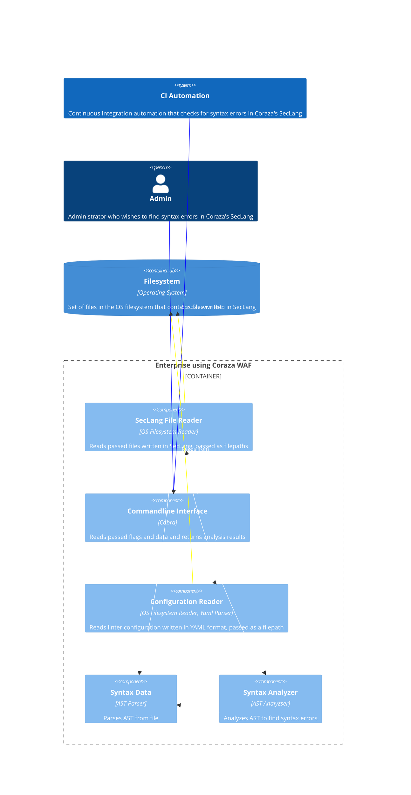

# Component diagram

```mermaid
C4Component
    System(ci, "CI Automation", "Continuous Integration automation that checks for syntax errors in Coraza's SecLang")

    Person(admin, "Admin", "Administrator who wishes to find syntax errors in Coraza's SecLang")

    Container_Boundary(enterprise, "Enterprise using Coraza WAF") {
        Component(reader, "SecLang File Reader", "OS Filesystem Reader", "Reads passed files written in SecLang, passed as filepaths")

        Component(userdata, "Commandline Interface", "Cobra", "Reads passed flags and data and returns analysis results")

        Component(configuration, "Configuration Reader", "OS Filesystem Reader, Yaml Parser", "Reads linter configuration written in YAML format, passed as a filepath")

        Component(data, "Syntax Data", "AST Parser", "Parses AST from file")

        Component(analyzer, "Syntax Analyzer", "AST Analyzser", "Analyzes AST to find syntax errors")

        Rel(userdata, reader, "Sends data to")
        UpdateRelStyle(userdata, reader, $textColor="white", $lineColor="white", $offsetX="-40")

        Rel(userdata, configuration, "Sends data to")
        UpdateRelStyle(userdata, configuration, $textColor="white", $lineColor="white", $offsetX="-40")

        Rel(reader, data, "Sends data to")
        UpdateRelStyle(reader, data, $textColor="white", $lineColor="white")

        Rel(analyzer, data, "Analyzes data in")
        UpdateRelStyle(analyzer, data, $textColor="white", $lineColor="white", $offsetX="-40")

        Rel(reader, analyzer, "Requests analysis from")
        UpdateRelStyle(reader, analyzer, $textColor="white", $lineColor="white", $offsetX="-40")
    }

    ContainerDb(files, "Filesystem", "Operating System", "Set of files in the OS filesystem that contains files written in SecLang")

    Rel(admin, userdata, "Requests analysis from")
    UpdateRelStyle(admin, userdata, $textColor="white", $lineColor="blue")

    Rel(ci, userdata, "Sends user info to")
    UpdateRelStyle(ci, userdata, $textColor="white", $lineColor="blue")

    Rel(configuration, files, "Reads from")
    UpdateRelStyle(configuration, files, $textColor="white", $lineColor="yellow")

    Rel(reader, files, "Reads from")
    UpdateRelStyle(reader, files, $textColor="white", $lineColor="yellow", $offsetX="-200", $offsetY="-10")

    UpdateLayoutConfig($c4ShapeInRow="3", $c4BoundaryInRow="1")
```