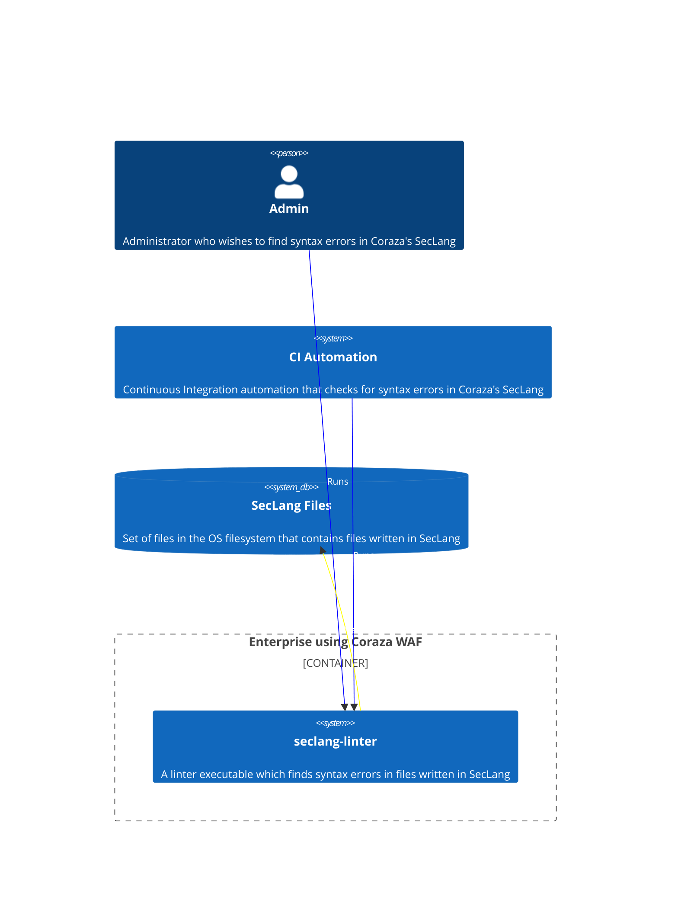

# Container diagram

```mermaid
C4Container
    Person(admin, "Admin", "Administrator who wishes to find syntax errors in Coraza's SecLang")

    System(ci, "CI Automation", "Continuous Integration automation that checks for syntax errors in Coraza's SecLang")

    SystemDb(files, "SecLang Files", "Set of files in the OS filesystem that contains files written in SecLang")

    Container_Boundary(enterprise, "Enterprise using Coraza WAF") {
        System(linter, "seclang-linter", "A linter executable which finds syntax errors in files written in SecLang")

        Rel(admin, linter, "Runs")
        Rel(ci, linter, "Runs")
        Rel(linter, files, "Reads")
    }

    UpdateRelStyle(admin, linter, $textColor="white", $lineColor="blue", $offset="20")
    UpdateRelStyle(ci, linter, $textColor="white", $lineColor="blue", $offset="20")
    UpdateRelStyle(linter, files, $textColor="white", $lineColor="yellow", $offset="20")
```