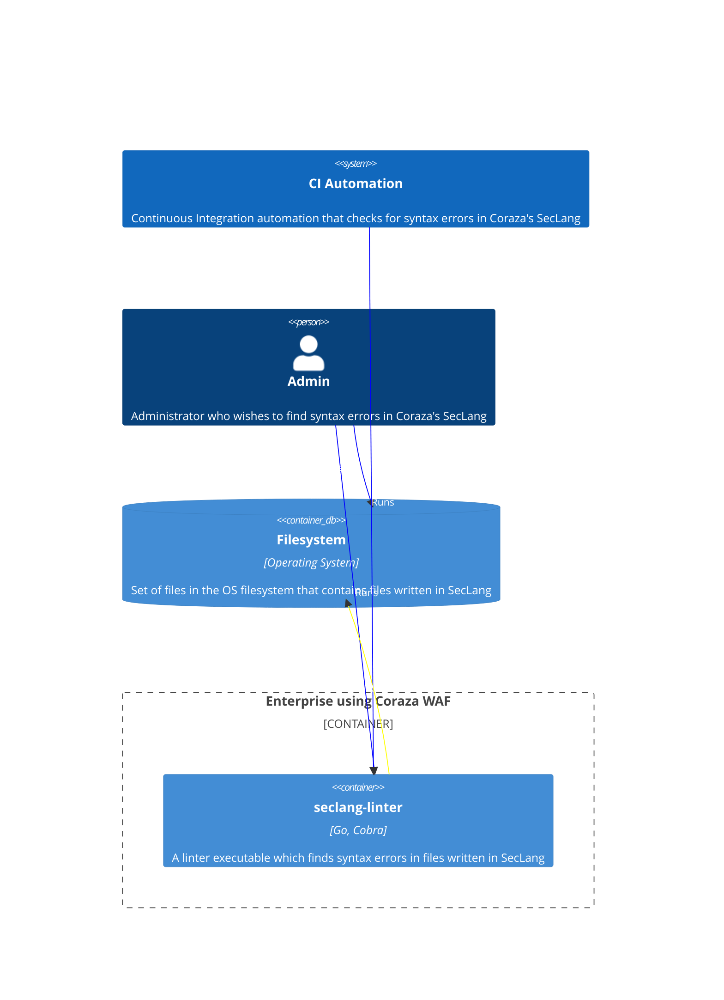

# Container diagram

```mermaid
C4Container
    System(ci, "CI Automation", "Continuous Integration automation that checks for syntax errors in Coraza's SecLang")

    Person(admin, "Admin", "Administrator who wishes to find syntax errors in Coraza's SecLang")

    Container_Boundary(enterprise, "Enterprise using Coraza WAF") {
        Container(linter, "seclang-linter", "Go, Cobra", "A linter executable which finds syntax errors in files written in SecLang")
    }

    ContainerDb(files, "Filesystem", "Operating System", "Set of files in the OS filesystem that contains files written in SecLang")

    Rel(admin, linter, "Runs")
    Rel(admin, files, "Places files in")
    Rel(ci, linter, "Runs")
    Rel(linter, files, "Reads")
    
    UpdateRelStyle(admin, linter, $textColor="white", $lineColor="blue", $offsetY="-10")
    UpdateRelStyle(admin, files, $textColor="white", $lineColor="blue", $offsetX="-40")
    UpdateRelStyle(admin, ci, $textColor="white", $lineColor="blue", $offsetX="-20")
    UpdateRelStyle(ci, linter, $textColor="white", $lineColor="blue")
    UpdateRelStyle(linter, files, $textColor="white", $lineColor="yellow")
```