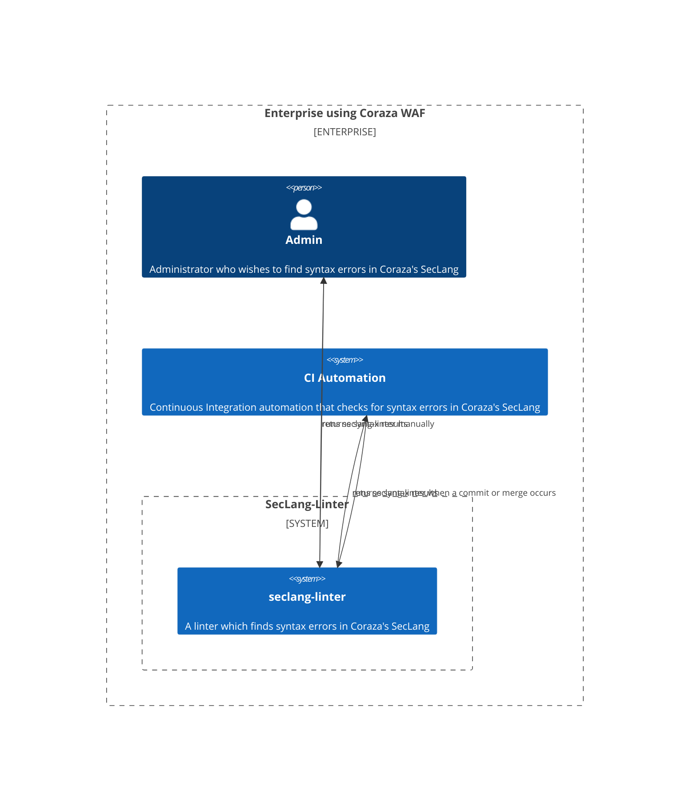

# System Context diagram

```mermaid
C4Context
    Enterprise_Boundary(enterprise, "Enterprise using Coraza WAF") {
        Person(admin, "Admin", "Administrator who wishes to find syntax errors in Coraza's SecLang")

        System(ci, "CI Automation", "Continuous Integration automation that checks for syntax errors in Coraza's SecLang")

        System_Boundary(linter, "SecLang-Linter") {
            System(linter, "seclang-linter", "A linter which finds syntax errors in Coraza's SecLang")
        }

        Rel(admin, linter, "runs seclang-linter manually")
        Rel(ci, linter, "runs seclang-linter when a commit or merge occurs")
        Rel(linter, ci, "returns syntax results")
        Rel(linter, admin, "returns syntax results")
    }
```