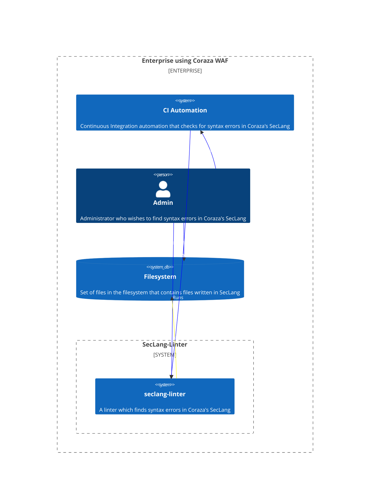

# System Context diagram

```mermaid
C4Context
    Enterprise_Boundary(enterprise, "Enterprise using Coraza WAF") {
        System(ci, "CI Automation", "Continuous Integration automation that checks for syntax errors in Coraza's SecLang")

        Person(admin, "Admin", "Administrator who wishes to find syntax errors in Coraza's SecLang")

        SystemDb(files, "Filesystem", "Set of files in the filesystem that contains files written in SecLang")

        System_Boundary(system, "SecLang-Linter") {
            System(linter, "seclang-linter", "A linter which finds syntax errors in Coraza's SecLang")
        }

        Rel(admin, linter, "Runs")
        Rel(admin, files, "Places files in")
        Rel(admin, ci, "Kicks off")
        Rel(ci, linter, "Runs")
        Rel(linter, files, "Reads")
    }

    UpdateRelStyle(admin, linter, $textColor="white", $lineColor="blue", $offsetY="-10")
    UpdateRelStyle(admin, files, $textColor="white", $lineColor="blue", $offsetX="-40")
    UpdateRelStyle(admin, ci, $textColor="white", $lineColor="blue", $offsetX="-20")
    UpdateRelStyle(ci, linter, $textColor="white", $lineColor="blue")
    UpdateRelStyle(linter, files, $textColor="white", $lineColor="yellow")
```