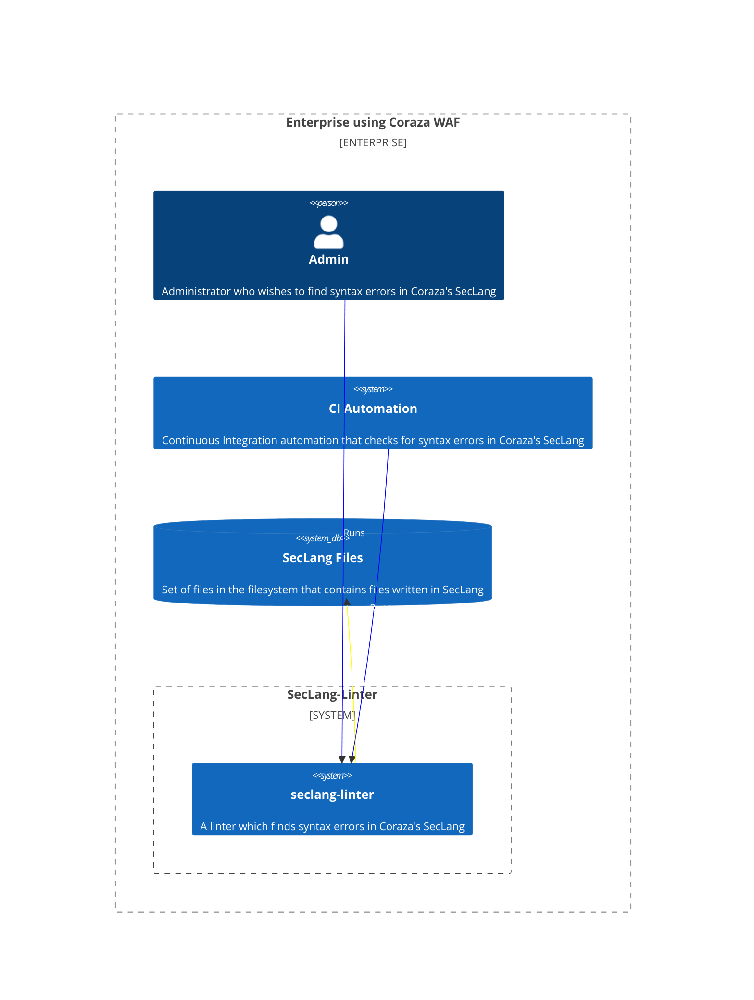

# System Context diagram

```mermaid
C4Context
    Enterprise_Boundary(enterprise, "Enterprise using Coraza WAF") {
        Person(admin, "Admin", "Administrator who wishes to find syntax errors in Coraza's SecLang")

        System(ci, "CI Automation", "Continuous Integration automation that checks for syntax errors in Coraza's SecLang")

        System_Boundary(system, "SecLang-Linter") {
            System(linter, "seclang-linter", "A linter which finds syntax errors in Coraza's SecLang")
        }

        SystemDb(files, "SecLang Files", "Set of files in the filesystem that contains files written in SecLang")

        Rel(admin, linter, "Runs")
        Rel(ci, linter, "Runs")
        Rel(linter, files, "Reads")
    }

    UpdateRelStyle(admin, linter, $textColor="white", $lineColor="blue", $offset="20")
    UpdateRelStyle(ci, linter, $textColor="white", $lineColor="blue", $offset="20")
    UpdateRelStyle(linter, files, $textColor="white", $lineColor="yellow", $offset="20")
```